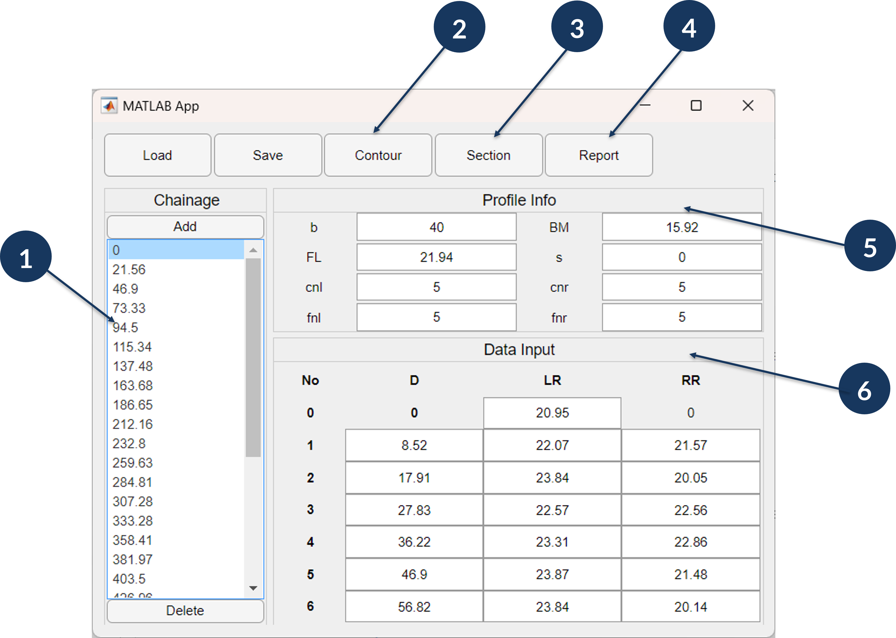
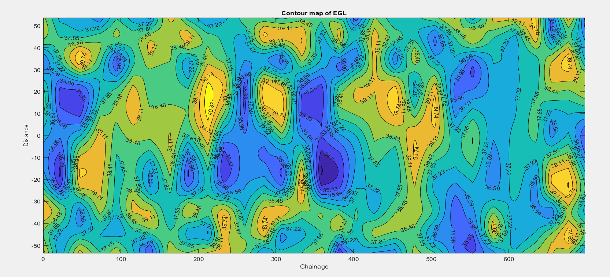
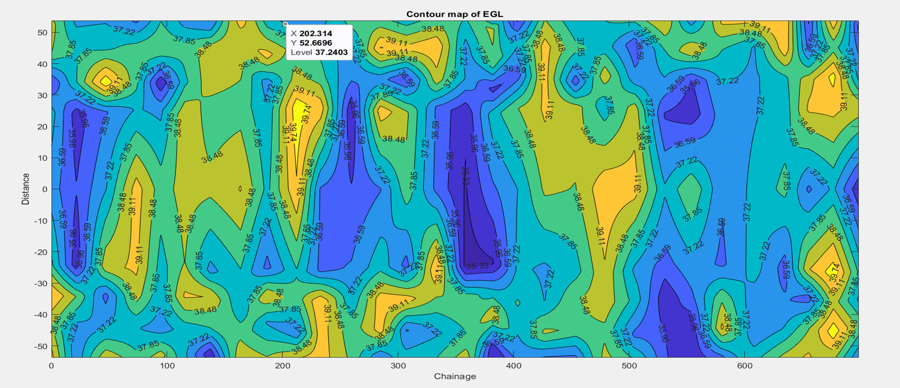
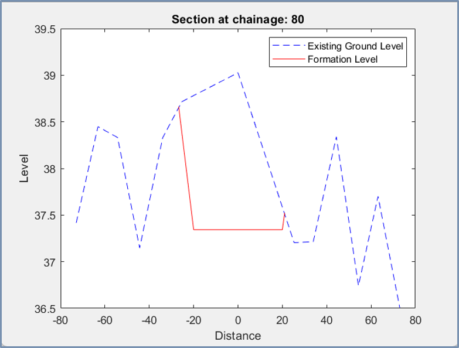
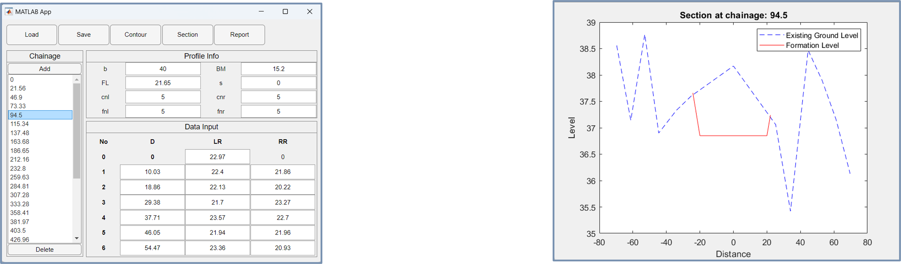

# Road Earthwork Calculation System (MATLAB)

## Overview
This project is a MATLAB-based application developed to calculate earthwork quantities for road construction using survey elevation data. The system enables terrain visualization through contour maps, generates cross-sectional profiles at selected chainages, and computes cut-and-fill volumes to support efficient road design and planning.

## Key Features
- Import survey elevation data from CSV files  
- Generate contour maps of the survey area  
- Plot cross-sectional profiles at any specified chainage  
- Calculate cut and fill volumes for road construction  
- Visualize terrain variations using interpolation techniques  

## Application Interface
The application provides an interactive interface to analyze survey data and compute earthwork quantities for road construction. The main components of the interface include:

1. **Chainage List Bar** – Used to select specific chainages for analysis  
2. **Show Contour Map** – Displays contour maps of the surveyed area  
3. **Cross-Sectional Profile** – Generates ground and formation level profiles at selected chainages  
4. **Cut and Fill Volume Report** – Calculates and reports earthwork quantities  
5. **Profile Information Panel** – Displays formation level, slope, and related parameters  
6. **Level Data Input** – Allows input of survey level data  

**Input Parameter Description**  
- **D** = Distance from center line  

### Interface Overview

*Graphical user interface developed in MATLAB for earthwork calculation and visualization.*

---

## Input Data
- Survey data provided in CSV format  
- 28 elevation readings per chainage  
- 13 ground level readings per cross-section  
- Input parameters include:
  - Distance from center line  
  - Left and right side level readings  
  - Formation level and slope details  

---

## Methodology
1. Load and preprocess survey elevation data  
2. Interpolate reduced levels using numerical techniques  
3. Generate contour maps using linear and spline interpolation  
4. Extract cross-sectional profiles at user-defined chainages  
5. Compute cut and fill volumes based on ground and formation levels  

---

## Contour Mapping

### Contour Map – Linear Interpolation

*Contour map generated using linear interpolation of survey elevation data.*

### Contour Map – Spline Interpolation

*Contour map generated using spline interpolation for smoother terrain representation.*

---

## Cross-Sectional Profiles

### Section at Selected Chainage

*Ground and formation level profile at a selected chainage.*

### Section at Another Chainage

*Cross-sectional profile illustrating cut and fill regions.*

---

## Outputs
- Contour maps of the surveyed area  
- Cross-sectional profiles at selected chainages  
- Cut and fill volume calculation reports  
- Graphical and numerical outputs for engineering analysis  

---

## Applications
- Road construction and earthwork estimation  
- Survey data visualization and validation  
- Academic and educational use in civil engineering projects  

---

## How to Run
1. Open MATLAB  
2. Clone or download this repository  
3. Open the `EVCS2.mlapp` script file  
4. Load the sample CSV survey data (`data2.csv`)  
5. Run the script and interact with the application interface  

---

## Tools & Technologies
- MATLAB  
- Numerical interpolation techniques  
- Data visualization and plotting  

---

## Project Type
Academic Engineering Project
